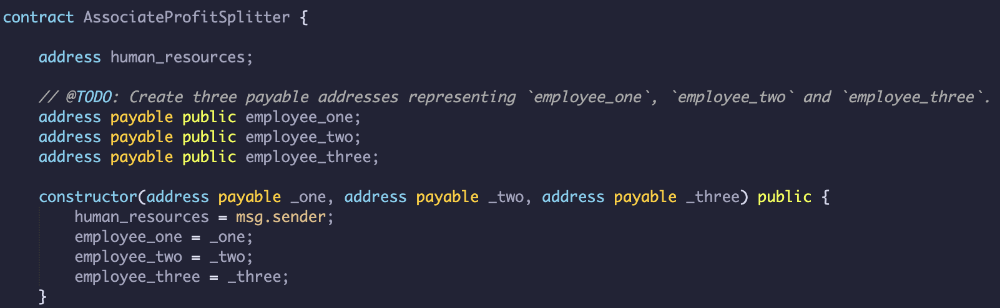
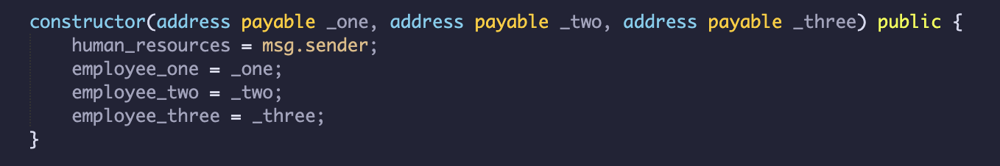
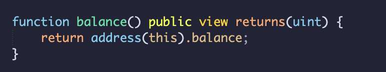
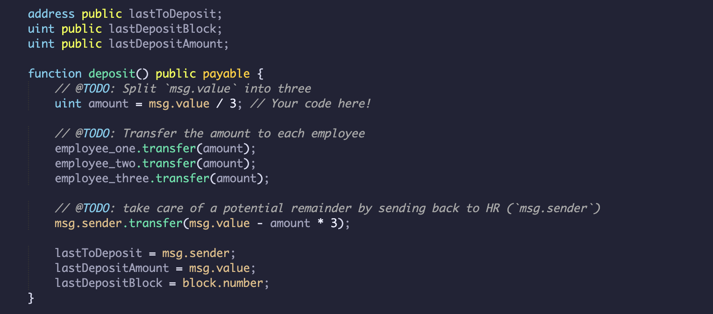
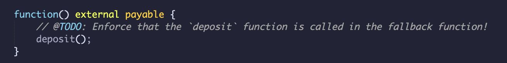
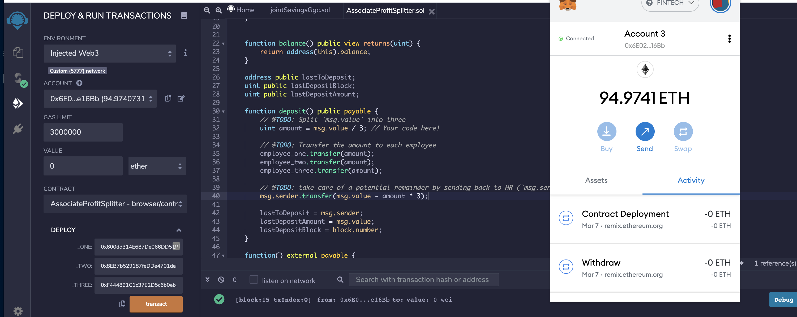
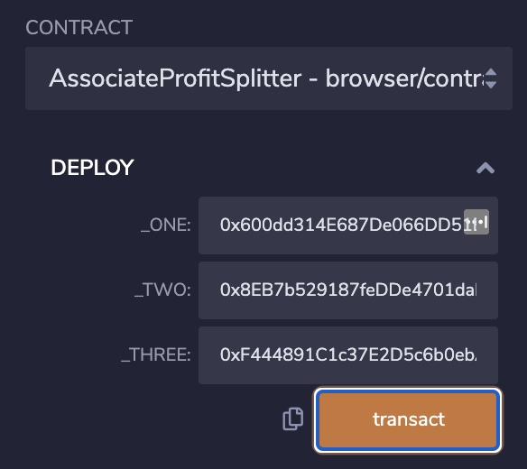
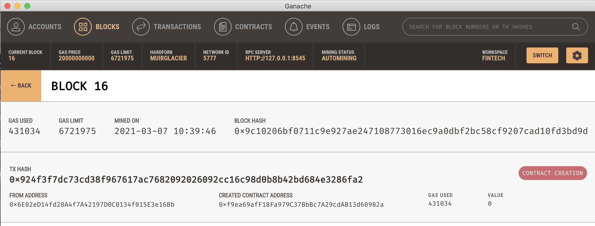
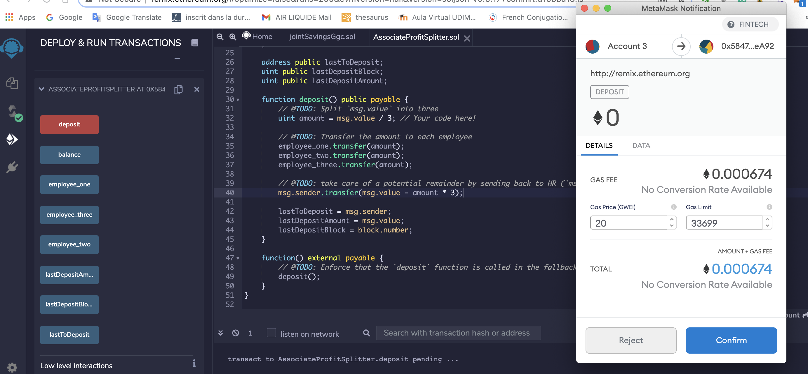
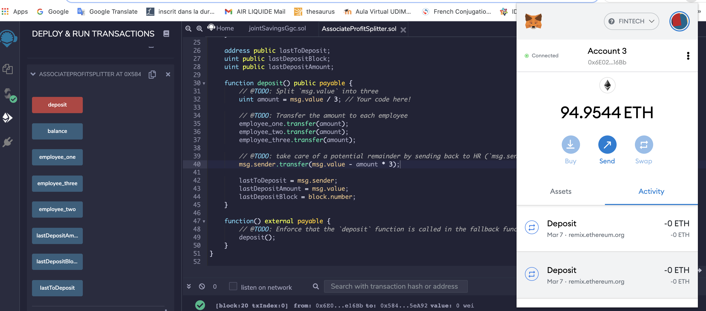

# hw20-Solidity

# Unit 20 - "Looks like we've made our First Contract!"

## Background

Your new startup has created its own Ethereum-compatible blockchain to help connect financial institutions, and the team wants to build smart contracts to automate some company finances to make everyone's lives easier, increase transparency, and to make accounting and auditing practically automatic!

Fortunately, you've been learning how to program smart contracts with Solidity! What you will be doing this assignment is creating 3 `ProfitSplitter` contracts. These contracts will do several things:

* Pay your Associate-level employees quickly and easily.

* Distribute profits to different tiers of employees.

* Distribute company shares for employees in a "deferred equity incentive plan" automatically.

## Files

* [`AssociateProfitSplitterV1.sol`](Code/AssociateProfitSplitterV1.sol) 

* [`TieredProfitSplitter.sol`](Starter-Code/TieredProfitSplitter.sol) 

* [`DeferredEquityPlan.sol`](Starter-Code/DeferredEquityPlan.sol) 

## `AssociateProfitSplitter` Contract. 
This will accept Ether into the contract and divide the Ether evenly among the associate level employees. This will allow the Human Resources department to pay employees quickly and efficiently.

At the top of your contract, you will need to define the following `public` variables:

* `employee_one` -- The `address` of the first employee. 

* `employee_two` -- 

* `employee_three` -- 

Create a constructor function that accepts:

* `address payable _one`

* `address payable _two`

* `address payable _three`

Within the constructor, set the employee addresses to equal the parameter values. This will allow you to avoid hardcoding the employee addresses.

* `balance` -- This function should be set to `public view returns(uint)`

* `deposit` -- This function should set to `public payable` check, ensuring that only the owner can call the function.

* Create a fallback function using `function() external payable`

#### Test the contract

* In the `Deploy` tab in Remix, 

* constructor parameters with your designated `employee` addresses.

* Ganache contract creation

* Deposit

